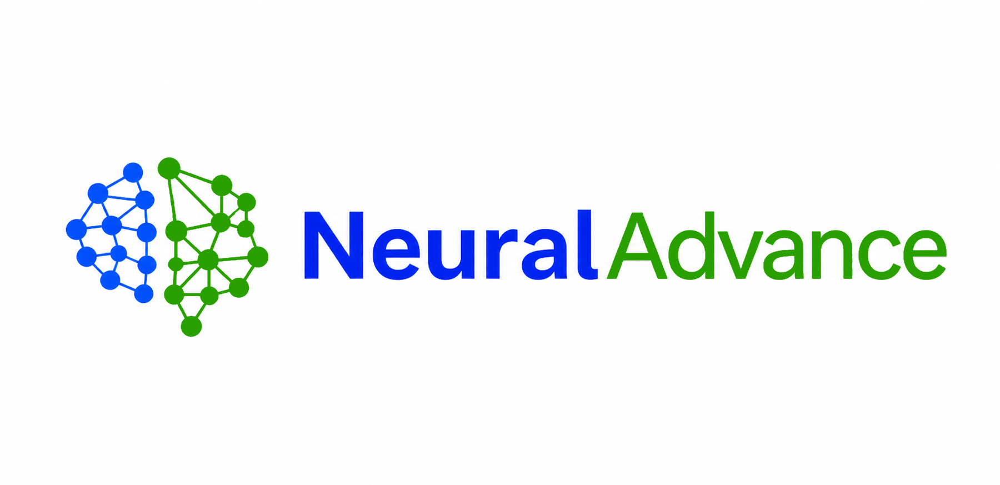

# Neuraladvance Apps

Aplicaciones gratuitas publicadas por cortesia de NeuralAdvance.net

## Descargas

- Alquiler por habitaciones (Gratis): release `alquiler-por-habitaciones-v1.0.0`
- FotoNotas Desktop: release `fotonotas-desktop-v0.1.1`
- Mini CRM: release `mini-crm-v1.0.0`

## Aplicaciones incluidas

### Alquiler por habitaciones (Gratis)

Herramienta de escritorio para la gestion local del alquiler por habitaciones.

### FotoNotas Desktop

Aplicacion de escritorio para trabajar con fotos, notas y seguimiento visual.

### Mini CRM

Mini CRM de escritorio para seguimiento comercial y gestion de clientes.

## Publicacion

Este repositorio usa GitHub Releases para distribuir los instaladores oficiales.

## Marca

- Logo principal del repositorio: `branding/logo-neuraladvance-horizontal.png`
- Logo redondo para usos de marca: `branding/logo-neuraladvance-round.png`
